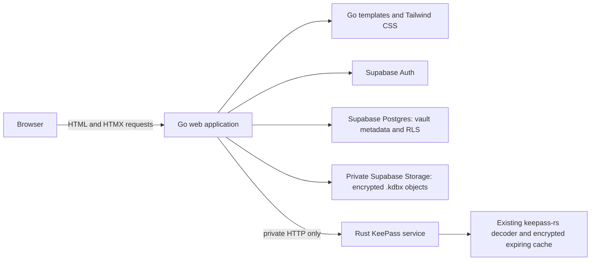

# HTMX, Go, Rust, and Supabase Implementation Workflow

## Goal

Build a personal multi-vault KeePass application with Go-rendered HTML, HTMX,
and Tailwind CSS. Go is the browser-facing backend and Supabase integration
layer. A private Rust service owns the existing `keepass-rs` decoding logic.

Version one supports a single account with multiple private vaults. Vault
sharing, organizations, invitations, concurrent editing, and conflict
resolution are out of scope.

## Architecture

## Security boundary

| Component | Responsibility | Must never persist |
| --- | --- | --- |
| Browser | Render HTML; keep the authenticated browser session; submit unlock data over HTTPS | Master password, key-file bytes, decoded vault data |
| Go | Authenticate, authorize, access Supabase, render HTML, call Rust | Master passwords, key files, decoded data, protected values |
| Supabase | Identity, vault metadata, encrypted `.kdbx` objects | KeePass secrets or decoded data |
| Rust | Open/read active vaults and maintain encrypted short-lived state | Long-lived plaintext vault data or request secrets |

Go transiently handles password/key-file request data while forwarding it to
Rust. Request bodies, tokens, decrypted entries, protected values, and
key-file bytes must not appear in logs, traces, error pages, or sessions.
Rust is internal-only: no public listener, route, or ingress.

## Supabase model

- `vaults` stores UUID `id`, `owner_id`, display name, private object path,
  timestamps, and non-sensitive upload state.
- Each user may own multiple vaults. Object paths are
  `<owner UUID>/<vault UUID>.kdbx` in a private Storage bucket.
- Row Level Security is enabled on every application table. Policies allow a
  user to access only rows where `owner_id = auth.uid()`.
- Storage policies permit objects only when the leading object-path segment
  equals `auth.uid()`.
- Browser assets contain only public Supabase configuration. Service-role
  credentials are backend-only and never rendered or bundled.

## Go-to-Rust service contract

Go calls Rust using authenticated private HTTP over loopback or a private
container network. Go supplies a short-lived service credential and
correlation ID; Rust rejects public-origin traffic and never trusts
browser-supplied ownership claims.

| Operation | Inputs from Go | Rust response |
| --- | --- | --- |
| Unlock | authorized vault ID, encrypted object bytes, password/key file, user ID | opaque active-vault handle and expiry |
| Groups | handle and user ID | safe group tree |
| Entries, entry, search | handle, user ID, requested IDs/term | requested safe vault view |
| Reveal | handle, user ID, entry ID, field name | requested value only |
| Close | handle and user ID | cleanup acknowledgement |

Rust binds every handle to its user and vault IDs. It retains the existing
encrypted expiring cache, clearing the cache/key on close, expiry, logout
notification, or authorization failure. KeePass decoding is never rewritten
in Go.

## Delivery phases

### Phase 0 — Baseline and operations

- Capture current tests and supported tool versions.
- Add ignored configuration templates for Go, Rust, and Supabase.
- Define development, staging, production, and a topology where only Go has a
  public port.
- Redact authorization headers, request bodies, passwords, key files, vault
  contents, and protected values from logging.

**Exit gate:** baseline tests pass, no real secret is committed, and Rust has
no public network exposure.

### Phase 1 — Supabase multi-vault foundation

- Add version-controlled migrations for `vaults`, indexes, RLS, private
  Storage, and Storage policies.
- Configure Supabase Auth for the personal account flow.
- Implement owner-scoped vault creation/listing/deletion and `.kdbx`
  upload/download.
- Test with two accounts and prove cross-user table/object operations fail.

**Exit gate:** an account owns multiple vaults but cannot discover a second
account's metadata or objects.

### Phase 2 — Rust KeePass service extraction

- Expose the current decoder, encrypted cache, key handling, groups, entries,
  protected fields, and search through the private HTTP contract.
- Replace browser/session assumptions with trusted Go identity plus explicit
  user and vault IDs.
- Test malformed requests, unauthorized/cross-user handle use, decode failure,
  close, and cache expiry.

**Exit gate:** Rust unlocks and reads a fixture vault through internal
requests only, with no cross-user handle replay.

### Phase 3 — Go backend and Supabase client

- Create Go configuration, Supabase Auth validation, vault repository, Rust
  client, templates, and handlers.
- Validate Supabase sessions on every protected request and check vault
  ownership before object retrieval or Rust calls.
- Store only an opaque active-vault handle in the browser session.
- Translate Rust errors into generic user-safe messages.

**Exit gate:** Go authenticates an owner, lists owned vaults, retrieves an
authorized object, calls Rust, and cleans up on close/logout.

### Phase 4 — HTMX and Tailwind interface

- Serve initial pages with Go templates and Tailwind as a static asset.
- Return HTMX fragments for sign-in state, vault selection, upload, unlock,
  groups, entries, search, detail, reveal, close, and expiry/logout.
- Retain ordinary HTML form fallbacks for critical actions.
- Add CSRF protection to mutations and secure, HttpOnly, SameSite cookies.

**Exit gate:** normal HTML works and HTMX enhances it without secrets in page
source or browser storage.

### Phase 5 — Verification and release readiness

- Add Go tests for sessions, ownership, handlers, Rust-client calls, and log
  redaction; add Rust contract/cache-cleanup tests.
- Add browser tests for sign-in, multiple vaults, upload, unlock, browsing,
  search, protected reveal, close, expiry, logout, and account isolation.
- Validate RLS/Storage in a non-production Supabase project and inspect logs,
  generated HTML, and assets for secrets.
- Document deployment, configuration, backup/restore, rollback, and account
  recovery.

**Exit gate:** all tests pass, cross-user isolation is proven, Rust remains
private, and no secret appears in source control, browser assets, sessions,
or logs.

## Definition of done

A signed-in user can manage multiple private `.kdbx` vaults through a
Go-rendered HTMX/Tailwind UI. Go authorizes Supabase access, Rust alone decodes
active vaults, and tests prove normal use, access denial, expiry, logout
cleanup, and secret redaction.
