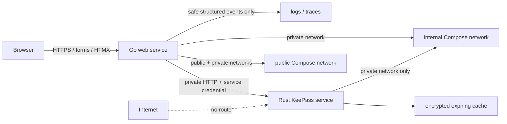

# Phase 1: Baseline & Operations - Research

**Researched:** 2026-08-02
**Domain:** safe Go/Rust service foundation, private container topology, configuration, and sensitive-data observability
**Confidence:** MEDIUM

## Summary

Phase 1 should establish a two-service runtime now: a public Go web service and an internal-only Rust service. The repository's current Compose configuration publishes Rust with `DATA_A7F3K9Q2_START "8080:8080" DATA_A7F3K9Q2_END`, which violates the approved target boundary and must be replaced before any Go-to-Rust functionality is added. [VERIFIED: docker-compose.yml:3-9] Docker Compose documents that `expose` is container-network-only while `ports` publishes to the host; an `internal: true` network has no external gateway. [CITED: https://docs.docker.com/compose/how-tos/networking/] [CITED: https://docs.docker.com/reference/compose-file/services/]

Keep the new Go foundation dependency-free: use the standard library for configuration and `log/slog` for structured logging, with a single allow-list event schema and a `ReplaceAttr` redaction boundary. The current Rust process starts `env_logger` and wraps Actix with its default request logger, so the existing logging path must be treated as unsafe for password-bearing routes until it is replaced or proven redacting. [VERIFIED: src/server/server.rs:16-49] Go's standard `slog.HandlerOptions.ReplaceAttr` can rewrite every non-group attribute and discard an attribute by returning the zero `Attr`. [CITED: https://pkg.go.dev/log/slog]

The current CI pins Node only to `DATA_Q6M2V8L4_START node-version: '20' DATA_Q6M2V8L4_END` and invokes Cargo without `--locked`; this does not yet capture a complete reproducible Go/Rust baseline. [VERIFIED: .github/workflows/test.yml:25-46] Establish the supported versions through a one-time green baseline, commit the exact Rust and Go constraints, and make CI fail when `Cargo.lock` would change. Cargo documents that `cargo test --locked` fails when the lockfile is missing or dependency resolution would modify it. [CITED: https://doc.rust-lang.org/cargo/commands/cargo-test.html]

**Primary recommendation:** Build the Go configuration/redaction package and the public/private Compose boundary as the first tracer slice; make CI and documentation enforce that contract before implementing Auth, Supabase data, or the Rust HTTP API.

<phase_requirements>
## Phase Requirements

| ID | Description | Research Support |
|----|-------------|------------------|
| FOUND-01 | A developer can run captured baseline tests with supported Go, Rust, and Supabase tool versions. | Pin and document verified Go/Rust/Node/Supabase CLI versions; run `cargo test --locked`, `go test ./...`, and the existing Playwright command in CI. [VERIFIED: .github/workflows/test.yml:12-46] [CITED: https://doc.rust-lang.org/cargo/commands/cargo-test.html] |
| FOUND-02 | An operator configures dev, staging, and production from ignored Go, Rust, and Supabase templates with no real secret committed. | Commit only `*.example` templates and non-secret `supabase/config.toml`; ignore all actual environment files and reject missing values by name only. [CITED: https://supabase.com/docs/guides/local-development/managing-config] |
| FOUND-03 | Go is the only public service; Rust is reachable only on its private network. | Use a public network for Go, a `private: { internal: true }` network shared by Go/Rust, `ports` only on Go, and no Rust host mapping. [CITED: https://docs.docker.com/compose/how-tos/networking/] |
| FOUND-04 | Sensitive request/vault data are absent from logs, traces, errors, and sessions. | Introduce deny-by-default structured logging, safe error mapping, trace-body suppression, and tests which inject sentinel data then inspect logs/errors/session serialization. [CITED: https://pkg.go.dev/log/slog] [CITED: https://cheatsheetseries.owasp.org/cheatsheets/Logging_Cheat_Sheet.html] |
</phase_requirements>

## Architectural Responsibility Map

| Capability | Primary Tier | Secondary Tier | Rationale |
|------------|--------------|----------------|-----------|
| Public HTTP/TLS ingress and browser-facing health endpoint | API / Backend (Go) | CDN / Static | The public listener belongs exclusively to Go under the locked topology. [VERIFIED: .planning/PROJECT.md:42-44] |
| KeePass decoding and active-vault cache | API / Backend (Rust, private) | Database / Storage | The retained `keepass-rs` implementation is the decoder authority and must never have public ingress. [VERIFIED: .planning/PROJECT.md:43-44] |
| Go-to-Rust service authentication | API / Backend | — | Service credential validation and caller identity are server-to-server concerns, not browser state. [VERIFIED: .planning/WORKFLOW.md:52-65] |
| Environment configuration and secret injection | Deployment / Runtime | API / Backend | Runtime configuration is supplied outside source control; applications validate it before serving traffic. [CITED: https://supabase.com/docs/guides/local-development/managing-config] |
| Log and trace redaction | API / Backend | Deployment / Runtime | The application must prevent secret attributes at emission; collectors must receive only the safe output. [CITED: https://pkg.go.dev/log/slog] [CITED: https://cheatsheetseries.owasp.org/cheatsheets/Logging_Cheat_Sheet.html] |
| Toolchain and baseline test enforcement | CI / Build | API / Backend | The checked-in workflow is the reproducibility gate for Rust, Go, JS, and Compose validation. [VERIFIED: .github/workflows/test.yml:11-55] |

## Standard Stack

### Core

| Library / Tool | Version | Purpose | Why Standard |
|----------------|---------|---------|--------------|
| Go standard library (`log/slog`, `os`, `net/http`) | Exact Go version captured after the first green baseline | Public service configuration and safe structured logging | `slog` is in the standard library and permits centralized attribute rewriting/removal through `ReplaceAttr`. [CITED: https://pkg.go.dev/log/slog] |
| Rust + Cargo lockfile | Exact Rust toolchain captured after the first green baseline | Preserve and test the existing decoder | `cargo test --locked` enforces the committed dependency graph in CI. [CITED: https://doc.rust-lang.org/cargo/commands/cargo-test.html] |
| Docker Compose | Installed locally: v5.1.2 | Development/deployment topology | Compose supports service-only `expose` ports and internal networks required for the private Rust boundary. [VERIFIED: local environment command `docker compose version`, 2026-08-02] [CITED: https://docs.docker.com/compose/how-tos/networking/] |
| Supabase CLI | Present locally; sandboxed version probe cannot write its telemetry file | Local Supabase configuration and migrations in later phases | `supabase init` creates a commit-safe `supabase/config.toml`; secrets can reference ignored environment variables. [CITED: https://supabase.com/docs/guides/local-development/cli-workflows] |

### Supporting

| Tool | Purpose | When to Use |
|------|---------|-------------|
| GitHub Actions | Baseline and pull-request verification | Update the existing `test.yml` to install exact Go/Rust versions, run lockfile-safe Rust tests, Go tests, frontend build, and topology/static-redaction checks. [VERIFIED: .github/workflows/test.yml:1-55] |
| Playwright (existing) | Browser baseline regression | Retain the existing `npm test` workflow, but keep it outside the Go/Rust redaction unit-test loop because its configured `webServer` currently launches Cargo directly. [VERIFIED: playwright.config.js:3-34] |

### Alternatives Considered

| Instead of | Could Use | Tradeoff |
|------------|-----------|----------|
| Go `slog` redaction handler | Third-party logging/redaction package | Do not add one in Phase 1: the standard handler hook directly supports centralized removal and avoids a new dependency/security surface. [CITED: https://pkg.go.dev/log/slog] |
| Compose private network | Binding Rust to host loopback only | Loopback is acceptable for a non-container local mode, but Compose needs a service-discoverable private network for Go-to-Rust calls. [CITED: https://docs.docker.com/compose/how-tos/networking/] |

**Installation:** No new application package should be installed in this phase. [ASSUMED]

## Architecture Patterns

### System Architecture Diagram



### Recommended Project Structure

```text
cmd/web/                   # Go public-process entry point
internal/config/           # validate env without exposing values
internal/observability/    # slog setup, redaction, safe error helpers
rust-service/              # Rust private-process runtime/config boundary
deploy/compose/            # Compose topology and per-environment examples
supabase/                  # committed non-secret CLI config and future migrations
docs/operations/           # runbook, toolchain, deployment/rollback instructions
```

### Pattern 1: Validate configuration before binding

**What:** Load all required runtime values at startup; errors identify only the missing key name, never its value. The process must exit before starting the public listener when validation fails. [ASSUMED]

**When to use:** Every Go and Rust entry point, and CI smoke commands that invoke those entries. [ASSUMED]

**Illustrative Go pattern:**

```go
// Pattern derived from Go's slog HandlerOptions API; redact by key before output.
func redact(groups []string, attr slog.Attr) slog.Attr {
    if isSensitiveLogKey(attr.Key) {
        return slog.Attr{}
    }
    return attr
}

logger := slog.New(slog.NewJSONHandler(os.Stderr, &slog.HandlerOptions{
    ReplaceAttr: redact,
}))
```

`ReplaceAttr` is the supported handler extension point; the sensitive-key predicate and the exact safe event schema are project decisions that must be unit-tested. [CITED: https://pkg.go.dev/log/slog] [ASSUMED]

### Pattern 2: Two Compose networks with one bridge service

**What:** Attach Go to both public and private networks; attach Rust only to private. Give only Go a `ports` mapping; Rust may use `expose` for Go’s container-to-container access. [CITED: https://docs.docker.com/compose/how-tos/networking/] [CITED: https://docs.docker.com/reference/compose-file/services/]

**When to use:** Development, staging, and production Compose-compatible deployments. Production ingress may sit in front of Go, but must not attach or publish Rust. [ASSUMED]

### Anti-Patterns to Avoid

- **Publishing the Rust port “for convenience”:** the checked-in Compose file presently maps a host port; remove that map from the Rust service and verify there is no Rust `ports` entry. [VERIFIED: docker-compose.yml:3-9]
- **Request logger defaults on sensitive routes:** current Rust wraps Actix `Logger::default()` after it initializes `env_logger`; do not assume default access logging excludes sensitive headers, bodies, or query strings. [VERIFIED: src/server/server.rs:16-49] [ASSUMED]
- **One shared `.env` for every environment:** use individual ignored runtime files/secrets for dev, staging, and production plus a committed non-secret example; never promote an example file into a real deployment secret store. [CITED: https://supabase.com/docs/guides/local-development/managing-config]
- **Exposing local Supabase:** Supabase documents that its local stack is development-only and must never be exposed to external traffic. [CITED: https://supabase.com/docs/guides/local-development/cli-workflows]

## Don't Hand-Roll

| Problem | Don't Build | Use Instead | Why |
|---------|-------------|-------------|-----|
| Structured log serialization | Custom JSON string formatting | Go `slog` JSON handler with one project redaction function | It centralizes output and `ReplaceAttr` can discard sensitive attributes. [CITED: https://pkg.go.dev/log/slog] |
| Container reachability | Application-level IP/origin filtering alone | Compose private network plus no Rust host `ports` mapping | Network policy makes public reachability absent before HTTP authorization executes. [CITED: https://docs.docker.com/compose/how-tos/networking/] |
| Secret storage in repository | Encrypted/obfuscated files committed with app source | Runtime secret store plus ignored environment files and templates | Supabase documents using `env()` references and excluding the actual `.env` from Git. [CITED: https://supabase.com/docs/guides/local-development/managing-config] |
| Deterministic Rust dependency selection | Script that compares printed versions | `Cargo.lock` with `cargo test --locked` | Cargo fails if it would create/change the lockfile. [CITED: https://doc.rust-lang.org/cargo/commands/cargo-test.html] |

**Key insight:** the privacy boundary must be enforced by deployment topology and data flow before it is reinforced by service authentication. [ASSUMED]

## Common Pitfalls

### Pitfall 1: A service is private in documentation but public in Compose

**What goes wrong:** A Rust `ports` entry makes its listener reachable from the Docker host despite an intended internal-only contract. [CITED: https://docs.docker.com/reference/compose-file/services/]

**How to avoid:** CI must parse the resolved Compose configuration and fail unless Go is the only service with `ports`; Rust must be limited to the internal network. [ASSUMED]

**Warning signs:** `docker compose config` shows a Rust `ports` section, or a host port scan reaches Rust directly. [ASSUMED]

### Pitfall 2: Redaction only after logs leave the process

**What goes wrong:** A collector-side filter cannot protect a secret already emitted to stdout, an error string, a trace attribute, or a test artifact. OWASP specifically lists access tokens, authentication passwords, session identifiers, database connection strings, and encryption keys among data usually not recorded directly. [CITED: https://cheatsheetseries.owasp.org/cheatsheets/Logging_Cheat_Sheet.html]

**How to avoid:** Do not pass sensitive data to logger/error constructors; add the `slog` redaction handler as defense in depth; disable request-body capture and assert sentinel absence from every captured output. [CITED: https://pkg.go.dev/log/slog] [ASSUMED]

### Pitfall 3: Treating CI image defaults as a pinned Rust toolchain

**What goes wrong:** Current backend CI runs Cargo without a Rust setup/pin step; a runner image update can silently change the compiler used for baseline tests. [VERIFIED: .github/workflows/test.yml:12-23]

**How to avoid:** First record the exact successful compiler version, then install that version explicitly in CI and place the same version in the repository’s Rust toolchain declaration. [ASSUMED]

### Pitfall 4: Copying existing config directly into environment templates

**What goes wrong:** The root config is tracked, configures an all-interface listen address, and contains fields designed for the legacy all-in-one service. Copying it to a new Rust runtime would retain ambiguity about public binding and legacy credentials. [VERIFIED: config.yml:1-106]

**How to avoid:** Create distinct Go/Rust/Supabase templates that model only the approved topology and add a review test rejecting unapproved secret-bearing files. [ASSUMED]

## Code Examples

### Topology invariant test (illustrative)

```text
resolved Compose configuration
  public host mappings: [Go only]
  Rust host mappings:  []
  Go networks:         [public, private]
  Rust networks:       [private]
  private.internal:    true
```

Implement the assertion against `docker compose config --format json` if the installed Compose supports JSON output; otherwise parse the resolved YAML with a test-only YAML parser. The assertion is a project implementation recommendation, not an externally verified CLI guarantee. [ASSUMED]

### Redaction test (illustrative)

```go
func TestSensitiveSentinelsNeverReachCapturedOutputs(t *testing.T) {
    // Supply unique sentinel strings as request fields and credentials.
    // Exercise success and error paths.
    // Assert logs, error response, trace export, and encoded session lack each sentinel.
}
```

The test must cover the requirement’s request bodies, authorization headers, passwords, key-file bytes, tokens, decoded data, and protected values; concrete request/response schema belongs to later phase contracts. [ASSUMED]

## State of the Art

| Old Approach | Current Approach | Impact |
|--------------|------------------|--------|
| Legacy single Rust web process and publicly mapped Compose port | Public Go edge plus internal Rust service network | Enforces the approved browser/Rust separation at deployment time. [VERIFIED: docker-compose.yml:3-9] [VERIFIED: .planning/PROJECT.md:42-44] |
| Unpinned runner Rust default | Explicit compiler/toolchain plus `cargo test --locked` | Makes a dependency-resolution or toolchain drift a visible CI failure. [VERIFIED: .github/workflows/test.yml:12-23] [CITED: https://doc.rust-lang.org/cargo/commands/cargo-test.html] |

## Assumptions Log

| # | Claim | Section | Risk if Wrong |
|---|-------|---------|---------------|
| A1 | No new application package is required; Go standard library is sufficient for Phase 1. | Standard Stack | A later requirement could justify a vetted dependency and require a package-legitimacy review. |
| A2 | The first green CI baseline can supply the exact Go/Rust version values to commit. | Summary / Pitfall 3 | The selected compiler may not support existing dependencies; capture must precede pinning. |
| A3 | CI can evaluate the resolved Compose topology as a static policy check. | Code Examples | Installed Compose output compatibility may require a YAML fallback. |
| A4 | Sensitive values can be covered by sentinel-injection tests before the future service schemas are complete. | Code Examples | Tests may need adaptation once Go/Rust contracts are finalized. |

## Open Questions

1. **Exact supported Go and Rust patch versions**
   - What we know: the repository has no `go.mod` or Rust toolchain pin, and Go/Cargo are absent from this workstation’s shell. [VERIFIED: repository scan, 2026-08-02] [VERIFIED: local environment command probes, 2026-08-02]
   - What is unclear: which exact versions compile the current Cargo lockfile and the new Go skeleton in CI.
   - Recommendation: make the first Phase 1 task capture versions from a green CI run, then commit those exact values and use them in local/CI setup. [ASSUMED]

2. **Production secret manager and ingress platform**
   - What we know: the approved topology requires separate development, staging, and production configuration, but does not select a cloud or secret manager. [VERIFIED: .planning/REQUIREMENTS.md:12-15]
   - What is unclear: provider-specific deployment and rotation commands.
   - Recommendation: define a provider-neutral environment-variable contract in Phase 1 and defer the backing secret store choice to an operator decision before production deployment. [ASSUMED]

## Environment Availability

| Dependency | Required By | Available | Version | Fallback |
|------------|-------------|-----------|---------|----------|
| Docker Compose | Private/public topology validation | ✓ | v5.1.2 | — [VERIFIED: local environment command `docker compose version`, 2026-08-02] |
| Go toolchain | New public service and tests | ✗ | — | Install the Phase 1 captured version. [VERIFIED: local environment command probe, 2026-08-02] |
| Rust/Cargo | Existing decoder baseline | ✗ | — | Install the Phase 1 captured version. [VERIFIED: local environment command probe, 2026-08-02] |
| Node/npm | Existing frontend baseline | ✓ | Node v25.9.0 / npm 11.12.1 | CI remains Node 20 until it is deliberately updated. [VERIFIED: local environment command probes, 2026-08-02] [VERIFIED: .github/workflows/test.yml:32-38] |
| Supabase CLI | Local config/migration workflow | ⚠ present | Version probe is blocked by sandbox telemetry write | Run in a normal developer shell or set the tool’s supported telemetry configuration; local stack also requires Docker. [VERIFIED: local environment command probe, 2026-08-02] |

**Missing dependencies with no fallback:** Go and Rust/Cargo must be installed before a developer can execute FOUND-01 locally. [VERIFIED: local environment command probes, 2026-08-02]

**Missing dependencies with fallback:** None. [VERIFIED: local environment command probes, 2026-08-02]

## Validation Architecture

### Test Framework

| Property | Value |
|----------|-------|
| Rust framework | Cargo/libtest through `cargo test`; existing baseline. [VERIFIED: .github/workflows/test.yml:20-23] |
| Browser framework | Playwright, configured in `playwright.config.js`. [VERIFIED: playwright.config.js:1-34] |
| Go framework | Go standard `testing` package — Wave 0 add with the new Go module. [ASSUMED] |
| Quick run command | `cargo test --locked` for existing Rust; `go test ./...` after Wave 0. [CITED: https://doc.rust-lang.org/cargo/commands/cargo-test.html] [ASSUMED] |
| Full suite command | CI equivalent of locked Rust, Go unit tests, frontend build, and Playwright. [VERIFIED: .github/workflows/test.yml:12-55] [ASSUMED] |

### Phase Requirements → Test Map

| Req ID | Behavior | Test Type | Automated Command | File Exists? |
|--------|----------|-----------|-------------------|-------------|
| FOUND-01 | Pinned tools run captured baseline | CI/integration | `cargo test --locked`, `go test ./...`, `npm test` | ❌ Go/pins Wave 0; ✅ Rust/Playwright baseline |
| FOUND-02 | Templates are safe and real secrets ignored | Unit/static | `go test ./internal/config` and repository ignore-file scan | ❌ Wave 0 |
| FOUND-03 | Only Go has a public port | Static Compose policy | `docker compose config` plus topology assertion | ❌ Wave 0 |
| FOUND-04 | Sentinels absent from logs/errors/traces/sessions | Unit/integration | `go test ./internal/observability ./internal/config` and Rust logging regression test | ❌ Wave 0 |

### Sampling Rate

- **Per task commit:** relevant package test plus `docker compose config` for topology/config changes. [ASSUMED]
- **Per wave merge:** locked Rust baseline, Go test suite, frontend build, and existing Playwright test command. [VERIFIED: .github/workflows/test.yml:20-46] [ASSUMED]
- **Phase gate:** full CI green; no committed real secret; resolved topology proves Rust lacks public exposure. [ASSUMED]

### Wave 0 Gaps

- [ ] `go.mod`, `cmd/web/main.go`, `internal/config/config_test.go` — establish Go toolchain/config baseline for FOUND-01/02. [ASSUMED]
- [ ] `internal/observability/redaction_test.go` — sentinel redaction tests for FOUND-04. [ASSUMED]
- [ ] Compose topology assertion and per-environment non-secret templates — FOUND-02/03. [ASSUMED]
- [ ] CI setup steps that install the committed Go/Rust versions and require lockfile-safe Rust tests — FOUND-01. [ASSUMED]

## Security Domain

### Applicable ASVS Categories

| ASVS Category | Applies | Standard Control |
|---------------|---------|------------------|
| V2 Authentication | Later phase | Phase 1 reserves private service credentials outside browser and source control; full user authentication is Phase 2. [VERIFIED: .planning/REQUIREMENTS.md:16-19] |
| V3 Session Management | Yes | Test that no sentinel secret can enter session serialization; later phases restrict browser sessions to opaque handles. [VERIFIED: .planning/PROJECT.md:47-48] [ASSUMED] |
| V4 Access Control | Yes | Infrastructure prevents direct public access to Rust; service-level authorization follows in Phase 3. [VERIFIED: .planning/REQUIREMENTS.md:20-28] [ASSUMED] |
| V5 Input Validation | Yes | Startup configuration validates presence/format without rendering the invalid value; request schema validation follows with Go/Rust contracts. [ASSUMED] |
| V6 Cryptography | Yes | Retain existing Rust encrypted-cache/key material path; do not write custom secret encryption. [VERIFIED: .planning/PROJECT.md:43-44] |
| V7 Error Handling and Logging | Yes | Structured redaction plus safe generic errors and sentinel regression tests. [CITED: https://pkg.go.dev/log/slog] [CITED: https://cheatsheetseries.owasp.org/cheatsheets/Logging_Cheat_Sheet.html] |

### Known Threat Patterns for Phase 1

| Pattern | STRIDE | Standard Mitigation |
|---------|--------|---------------------|
| Direct Rust port publication | Elevation of Privilege | No Rust `ports`; Rust only on the Compose internal network; CI inspects resolved topology. [CITED: https://docs.docker.com/compose/how-tos/networking/] [ASSUMED] |
| Secret in log, trace, error, or session | Information Disclosure | Never log sensitive inputs; centralized `slog` redaction; sentinel tests over all output sinks. [CITED: https://pkg.go.dev/log/slog] [CITED: https://cheatsheetseries.owasp.org/cheatsheets/Logging_Cheat_Sheet.html] |
| Secret accidentally committed | Information Disclosure | Ignore real environment files, commit templates only, and add CI secret/ignore policy checks. [CITED: https://supabase.com/docs/guides/local-development/managing-config] [ASSUMED] |
| Toolchain/dependency drift | Tampering / Availability | Exact toolchain declarations plus `cargo test --locked` CI. [CITED: https://doc.rust-lang.org/cargo/commands/cargo-test.html] |

## Sources

### Primary / cited official documentation

- [Go `log/slog` package documentation](https://pkg.go.dev/log/slog) — `ReplaceAttr`, handler behavior, and safe centralized structured logging.
- [Docker Compose networking](https://docs.docker.com/compose/how-tos/networking/) and [Compose service reference](https://docs.docker.com/reference/compose-file/services/) — internal networks, `ports`, and `expose` behavior.
- [Cargo `test` command](https://doc.rust-lang.org/cargo/commands/cargo-test.html) — `--locked` deterministic CI behavior.
- [Supabase managing config and secrets](https://supabase.com/docs/guides/local-development/managing-config) and [local CLI workflow](https://supabase.com/docs/guides/local-development/cli-workflows) — commit-safe config and ignored secret files.
- [OWASP Logging Cheat Sheet](https://cheatsheetseries.owasp.org/cheatsheets/Logging_Cheat_Sheet.html) — sensitive data excluded from logs.

### Repository evidence

- [docker-compose.yml](../../../docker-compose.yml) — current public Rust port mapping.
- [.github/workflows/test.yml](../../../.github/workflows/test.yml) — current test/tooling coverage.
- [src/server/server.rs](../../../src/server/server.rs) — legacy request logger and process binding.
- [config.yml](../../../config.yml) — legacy configuration and binding value.

## Metadata

**Confidence breakdown:**

- Standard stack: MEDIUM — authoritative docs confirm the capabilities; exact Go/Rust patch versions remain an execution-time baseline decision.
- Architecture: HIGH — locked project topology plus direct Compose/CI source inspection and Compose docs agree.
- Pitfalls: MEDIUM — direct repository evidence identifies current exposure/logging risks; remediation tests are project-specific recommendations.

**Research date:** 2026-08-02
**Valid until:** 2026-08-09 (fast-moving CLI/container behavior; refresh before execution)
