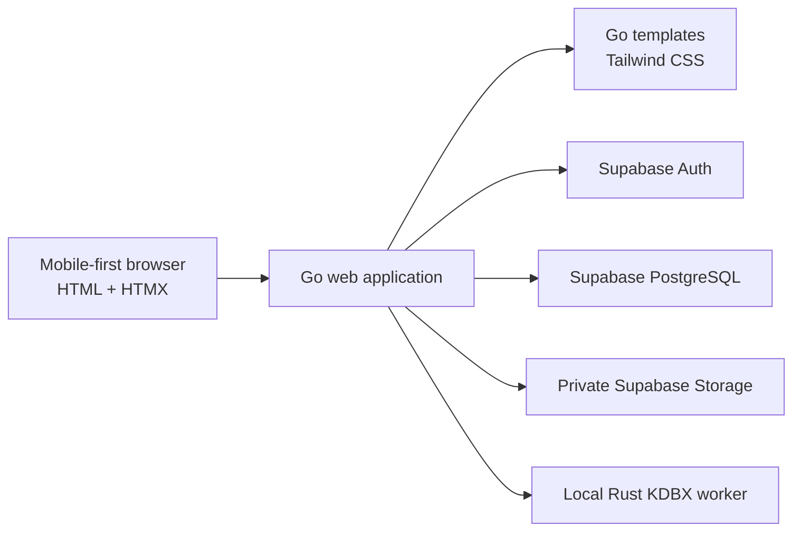

# KeePass Web Architecture

## 1. Purpose

This repository will become a single-user, multi-vault password web application. It will import encrypted KeePass (`.kdbx`) files, retain each original file as an immutable snapshot, and store an editable decoded representation in Supabase.

Version 1 supports:

- Email/password login for one allow-listed account
- Multiple named vaults, such as Personal and Work
- KDBX import with password and optional keyfile
- Browsing and searching groups and entries
- Creating, editing, moving, and soft-deleting entries
- Importing and downloading attachments
- A mobile-first, liquid-glass user interface

Writing changes back to KDBX, two-way synchronization, shared vaults, and attachment editing are explicitly deferred.

## 2. Architecture Decision

The system is a modular Go monolith with an isolated Rust decoder worker:



The browser communicates only with Go. It never queries Supabase directly and never receives Supabase service credentials. Go owns authentication, authorization, HTML rendering, application encryption, database access, Storage access, and import orchestration.

The Rust worker is a local executable in the same container. It has no HTTP API or database responsibility. Its only contract is to validate and decode KDBX input into a versioned normalized manifest.

## 3. Technology Stack

| Layer | Choice | Responsibility |
| --- | --- | --- |
| UI | Go `html/template`, HTMX, Tailwind CSS, minimal vanilla JavaScript | Server-rendered pages and fragments |
| Application | Go | HTTP, sessions, CRUD, encryption, jobs, and orchestration |
| KDBX | Rust and the existing `keepass-rs` decoder | Password/keyfile handling and KDBX traversal |
| Authentication | Supabase Auth | Email/password identity |
| Data | Supabase PostgreSQL | Vault structure, encrypted entry data, revisions, and sessions |
| Objects | Private Supabase Storage | Original KDBX snapshots and encrypted attachments |
| Delivery | Multi-stage Docker image | Tailwind, Rust, and Go build; one non-root runtime |

## 4. Component Boundaries

### Go web application

The Go application is divided into focused packages:

- `auth`: Supabase password authentication, allow-list enforcement, and opaque sessions
- `crypto`: versioned AES-256-GCM envelopes and key rotation
- `import`: temporary-file handling, worker execution, manifest validation, and compensation
- `vault`: vault, group, entry, attachment, and revision services
- `store`: PostgreSQL repositories and private Storage client
- `web`: middleware, handlers, full-page templates, and HTMX fragments
- `jobs`: import progress and retryable cleanup work

Handlers remain thin. They authenticate, parse input, call an application service, and render a page or fragment. Domain behavior does not depend on HTMX or HTTP types.

### Rust decoder worker

The worker retains only KDBX-specific behavior:

- Build a database key from a password and optional keyfile
- Open and validate a KDBX database
- Traverse groups, entries, protected/custom fields, tags, icons, and metadata
- Extract attachment data into restricted staging files
- Emit a schema-versioned manifest with stable KeePass UUIDs

Actix, authentication backends, database backends, sessions, kernel keyrings, cache encryption, and static-file serving are not part of the worker.

The encrypted KDBX path may be an argument. Passwords and keyfile bytes must use stdin or restricted inherited file descriptors, never arguments or environment variables. Manifest output uses stdout; logs use stderr and must redact secrets.

## 5. Data Model

Application tables live in migrations under `supabase/migrations/`.

| Table | Main purpose |
| --- | --- |
| `vaults` | Owner, encrypted display metadata, ordering, state, and current revision |
| `vault_imports` | Immutable source snapshot key, SHA-256, KDBX metadata, status, and import time |
| `groups` | Vault hierarchy, KeePass UUID, encrypted metadata, and display order |
| `entries` | Group relation, KeePass UUID, encrypted payload, revision, and soft-delete state |
| `attachments` | Entry relation, encrypted metadata, opaque object key, checksum, and size |
| `change_events` | Append-only create, update, move, and delete history |
| `app_sessions` | Hashed opaque session token, encrypted refresh material, expiry, and revocation |
| `jobs` | Import/cleanup state, retry count, and redacted failure category |

Entry payloads contain titles, usernames, URLs, passwords, notes, tags, custom fields, and other decoded values. These payloads are never stored as plaintext. Structural UUIDs, relationships, positions, revisions, statuses, sizes, and timestamps remain queryable.

The schema includes `owner_id` even while the application is single-user. This preserves a clean authorization boundary without claiming multi-user sharing support.

## 6. Encryption and Secrets

Go encrypts sensitive database payloads with AES-256-GCM. Every envelope contains a key version and random nonce. Associated authenticated data binds ciphertext to its owner, vault, record type, and record ID, preventing ciphertext from being moved between records undetected.

The versioned application master key is supplied by the deployment secret manager or runtime environment and is never stored in Supabase. Rotation introduces a new write key while retaining previous read keys until records have been re-encrypted.

Attachment bytes are encrypted before upload using a versioned, chunked authenticated envelope so large files need not be held entirely in memory. Original KDBX snapshots are stored unchanged because KeePass already encrypts them.

The KDBX master password and keyfile are import-only secrets. They are never logged, persisted, placed in process arguments, or reused as the application encryption key. Sensitive temporary files use unpredictable names, mode `0600`, bounded lifetimes, and guaranteed cleanup.

## 7. Authentication and Authorization

Supabase Auth provides email/password verification. Public signup is disabled; the sole account is provisioned administratively and checked against an application allow-list.

After successful login, Go creates a random opaque session token. The browser receives only its secure cookie; PostgreSQL stores its hash and encrypted Supabase refresh material. Cookies use `HttpOnly`, `Secure`, and `SameSite=Strict` where deployment routing permits. State-changing requests also require CSRF tokens.

Every service operation receives an authenticated user ID and constrains access by `owner_id`. Application tables use Row Level Security as defense in depth, and no anonymous table or Storage access is granted. Supabase service credentials remain server-only.

Login, import, secret reveal, and destructive endpoints are rate-limited. Security-sensitive responses set a restrictive Content Security Policy, `Cache-Control: no-store`, and appropriate framing and MIME-sniffing protections.

## 8. Import Lifecycle

Imports are staged and fail atomically from the user's perspective:

1. Go authenticates the request and validates CSRF, extension, size, and keyfile limits.
2. It streams the upload to a restricted temporary file while calculating SHA-256.
3. Go starts the Rust worker with a deadline and resource limits, then supplies credentials through its private input channel.
4. Rust validates the KDBX and emits a versioned manifest plus staged attachment references.
5. Go validates counts, sizes, UUIDs, hierarchy depth, and manifest version.
6. Go encrypts decoded records and attachments, uploads objects under opaque keys, and inserts records with vault status `importing`.
7. A database transaction marks the import and vault `active` only after all required writes succeed.
8. Go cleans credentials and temporary files on every exit path.

Storage and PostgreSQL cannot share one transaction. Import therefore uses explicit states and compensating deletion: failed or abandoned imports remain invisible, and a cleanup job removes orphaned objects.

A matching source checksum triggers confirmation. Version 1 can import it only as a separate vault; it cannot re-import into or merge over an existing edited vault. Existing-vault source revisions belong to the later synchronization design.

## 9. Editing Model

Supabase is the editable working representation. The retained KDBX snapshot is immutable.

Entry updates follow this transaction:

1. Load and authorize the entry.
2. Compare the submitted revision with the current revision.
3. Decrypt, validate, and merge allowed fields.
4. Encrypt the new payload.
5. Increment the revision and append a `change_event`.
6. Commit both records together.

A stale revision returns `409 Conflict` and an HTMX conflict fragment instead of overwriting another tab. Entry deletion is soft deletion so a future exporter can represent removal. Version 1 permits entry creation, editing, movement between existing groups, and deletion. Attachment upload/replacement and KDBX export are later phases.

## 10. Search

Searchable entry values remain encrypted in PostgreSQL. For version 1, Go loads the selected vault's entry payloads, decrypts them, and filters in memory. This is an intentional single-user trade-off that prevents plaintext search columns.

Results are bounded and input is length-limited. If profiling later shows unacceptable latency, the next design must evaluate keyed blind indexes or a short-lived encrypted cache; plaintext indexing is not the default upgrade path.

## 11. Frontend Architecture

The frontend is server-rendered and mobile-first. Go templates produce complete pages and reusable HTMX fragments. HTMX handles navigation, vault switching, search, forms, optimistic-conflict messages, and import-status polling.

Vanilla JavaScript is limited to browser-only behavior:

- Clipboard access
- Timed secret reveal/conceal
- Dialog focus management
- Small visual transitions

Secrets are excluded from initial HTML and fetched only after an explicit authorized reveal action.

The visual language is an original liquid-glass system: translucent layered surfaces, controlled backdrop blur, soft gradients, fine borders, restrained shadows, and rounded geometry. Readability takes priority over decoration. Solid fallbacks support browsers without backdrop filtering, reduced-motion preferences are respected, focus states are visible, and interactive targets are at least 44 by 44 CSS pixels.

Mobile uses a drill-down flow:

```text
Login → Vaults → Groups/entries → Entry detail
                 ↘ Import
```

Wider layouts progressively enhance this into a vault/group sidebar, entry list, and detail panel. Primary screens are login, vault dashboard, import, vault browser, entry detail, create/edit entry, attachment download, vault settings, and destructive-action confirmation.

## 12. HTTP Surface

Routes return full pages for normal navigation and fragments when `HX-Request` is present. Representative endpoints are:

```text
GET/POST  /login
POST      /logout
GET       /vaults
GET/POST  /vaults/import
GET       /vaults/{vaultID}
DELETE    /vaults/{vaultID}
GET       /vaults/{vaultID}/search
GET/POST  /vaults/{vaultID}/entries
GET/POST  /entries/{entryID}/edit
POST      /entries/{entryID}/move
DELETE    /entries/{entryID}
POST      /entries/{entryID}/reveal
GET       /attachments/{attachmentID}/download
GET       /jobs/{jobID}
```

Go uses method-specific routes internally; POST fallbacks may be provided for browsers where an HTML form cannot issue `DELETE`. Errors render accessible inline fragments for expected failures and correlation-ID error pages for unexpected failures.

## 13. Reliability and Observability

The application emits structured logs with request and job correlation IDs. Logs may contain vault/record UUIDs and redacted error categories, but never credentials, decoded fields, ciphertext, tokens, keyfile contents, or attachment names.

Worker execution has time, memory, output-size, attachment-size, entry-count, and hierarchy-depth limits. Malformed KDBX data, bad credentials, unsupported manifest versions, Storage failures, and database conflicts map to stable application error categories.

Background jobs are persisted before execution. Startup reconciliation marks interrupted imports for cleanup or retry. Health checks distinguish application liveness from Supabase readiness.

## 14. Repository Target

```text
cmd/web/                 Go entry point
internal/
  auth/
  crypto/
  import/
  jobs/
  store/
  vault/
  web/
templates/               Full pages and HTMX fragments
web/
  styles/                Tailwind source and design tokens
  static/                Compiled CSS and minimal JavaScript
decoder/                 Rust KDBX worker
supabase/migrations/     Schema, roles, policies, and indexes
tests/                   Integration, fixture, and browser tests
```

The old implementation is removed only after decoder extraction and parity tests pass. Removal scope includes the Actix server, old routes, authentication and database backends, kernel keyring/cache code, React/Browserify frontend, obsolete assets and configuration, and their dependencies. KeePass-relevant fixtures, decoder behavior, GPL licensing, and required third-party notices remain.

## 15. Testing Strategy

- **Rust golden tests:** valid password, invalid password, keyfile, nested groups, protected/custom fields, custom icons, and attachments
- **Go unit tests:** encryption envelopes, key versions, validation, session handling, ownership, and revision conflicts
- **Import integration tests:** malformed files, limits, worker timeout, Storage failure, database failure, and compensating cleanup
- **Database tests:** migrations, constraints, transactions, ownership policies, and soft deletion
- **Browser tests:** login, multi-vault import, browse/search, reveal/copy, create/edit/move/delete, attachment download, and stale-edit conflict
- **Responsive/accessibility tests:** narrow mobile viewports first, then tablet and desktop; keyboard navigation, focus, contrast, and reduced motion

No test may require production credentials or real personal KeePass data. Fixtures must be generated or sanitized and documented.

## 16. Deployment

A multi-stage Docker build:

1. Compiles Tailwind CSS.
2. Builds the Rust worker.
3. Builds the Go web binary.
4. Copies only runtime artifacts into a minimal non-root image.

The runtime receives Supabase endpoints/credentials, the allowed email, application key versions, cookie settings, and limits through deployment secrets and configuration. It requires outbound TLS access to Supabase and a small writable temporary directory. The decoder itself contains no network client and receives only the files and secrets needed for one job.

## 17. Deferred Work

- Export current Supabase state as a new KDBX
- Two-way KDBX synchronization and merge conflicts
- Attachment creation, replacement, and deletion
- Group creation, reorganization, and deletion
- Multiple users, invitations, and shared vaults
- Offline mode, browser extensions, and native applications
- Blind-index or cache-based search optimization

These require separate designs and must not be introduced implicitly during version 1.

## 18. Reference Documentation

- [Supabase password authentication](https://supabase.com/docs/guides/auth/passwords)
- [Supabase Row Level Security](https://supabase.com/docs/guides/database/postgres/row-level-security)
- [Supabase Storage access control](https://supabase.com/docs/guides/storage/security/access-control)
- [Supabase private buckets](https://supabase.com/docs/guides/storage/buckets/fundamentals)
